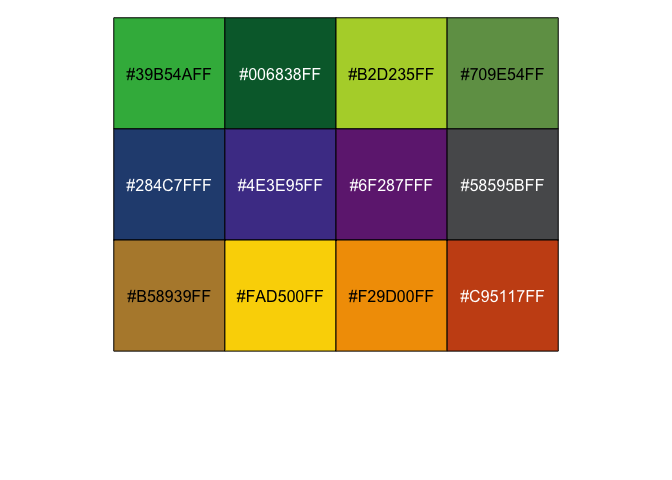
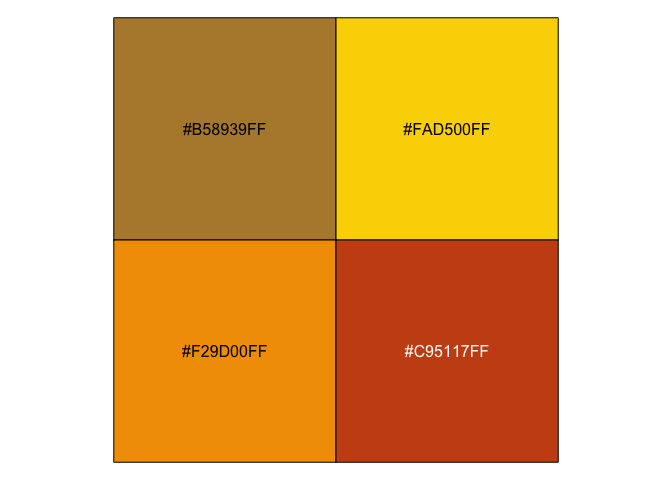

<!-- README.md is generated from README.Rmd. Please edit that file -->

# ggsano

<!-- badges: start -->

<!-- badges: end -->

The goal of ggsano is to uniform the use of colours within the institue
Sciensano. The ggsano package is open-source and can be downloaded by
everyone. Currently the package only includes a discrete and continuous
color palette, but regular updates are planned.

## Installation

Since ggsano is not available on [CRAN](https://CRAN.R-project.org), you
can download the development version from [GitHub](https://github.com/)
by executing the following code:

``` r
# install.packages("devtools")
devtools::install_github("rdpauw/ggsano")
#> Error in get(genname, envir = envir) : object 'testthat_print' not found
#> Downloading GitHub repo rdpauw/ggsano@HEAD
#> colorspace (1.4-1 -> 2.0-0) [CRAN]
#> vctrs      (0.3.1 -> 0.3.7) [CRAN]
#> utf8       (1.1.4 -> 1.2.1) [CRAN]
#> crayon     (1.3.4 -> 1.4.1) [CRAN]
#> cli        (2.0.2 -> 2.4.0) [CRAN]
#> pillar     (1.4.6 -> 1.5.1) [CRAN]
#> lifecycle  (0.2.0 -> 1.0.0) [CRAN]
#> fansi      (0.4.1 -> 0.4.2) [CRAN]
#> labeling   (0.3   -> 0.4.2) [CRAN]
#> farver     (2.0.3 -> 2.1.0) [CRAN]
#> tibble     (3.0.3 -> 3.1.0) [CRAN]
#> generics   (0.0.2 -> 0.1.0) [CRAN]
#> isoband    (0.2.2 -> 0.2.4) [CRAN]
#> dplyr      (1.0.0 -> 1.0.5) [CRAN]
#> ggplot2    (3.3.2 -> 3.3.3) [CRAN]
#> Installing 15 packages: colorspace, vctrs, utf8, crayon, cli, pillar, lifecycle, fansi, labeling, farver, tibble, generics, isoband, dplyr, ggplot2
#> Installing packages into '/private/var/folders/m4/4gvrf0_93g9gpy5hgcsypqyw0000gn/T/RtmpOJOgqS/temp_libpath89345d65cdc2'
#> (as 'lib' is unspecified)
#> 
#> The downloaded binary packages are in
#>  /var/folders/m4/4gvrf0_93g9gpy5hgcsypqyw0000gn/T//RtmpdhWWDr/downloaded_packages
#>      checking for file ‘/private/var/folders/m4/4gvrf0_93g9gpy5hgcsypqyw0000gn/T/RtmpdhWWDr/remotes91423d7ddd99/rdpauw-ggsano-8d3b4a0/DESCRIPTION’ ...  ✓  checking for file ‘/private/var/folders/m4/4gvrf0_93g9gpy5hgcsypqyw0000gn/T/RtmpdhWWDr/remotes91423d7ddd99/rdpauw-ggsano-8d3b4a0/DESCRIPTION’
#>   ─  preparing ‘ggsano’:
#>      checking DESCRIPTION meta-information ...  ✓  checking DESCRIPTION meta-information
#>   ─  checking for LF line-endings in source and make files and shell scripts
#>   ─  checking for empty or unneeded directories
#>        NB: this package now depends on R (>= 3.5.0)
#>        WARNING: Added dependency on R >= 3.5.0 because serialized objects in  serialize/load version 3 cannot be read in older versions of R.  File(s) containing such objects: ‘ggsano/data/x.rda’
#> ─  building ‘ggsano_0.0.0.9000.tar.gz’
#>      
#> 
#> Installing package into '/private/var/folders/m4/4gvrf0_93g9gpy5hgcsypqyw0000gn/T/RtmpOJOgqS/temp_libpath89345d65cdc2'
#> (as 'lib' is unspecified)
```

## Colours

Below are the standard discrete colours included in the ggsano package:

``` r
library(ggsano)
library(scales)
show_col(pal_sciensano()(12))
```



You can specify the colours in each row by specifying the `name`
argument in the functions

``` r
show_col(pal_sciensano(name = "yellow")(4))
```


