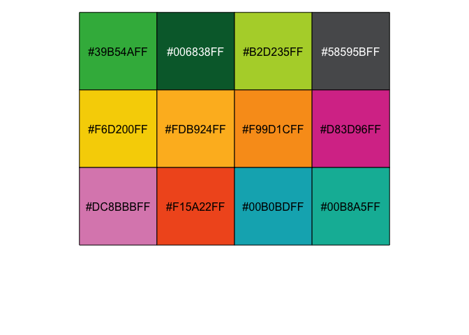
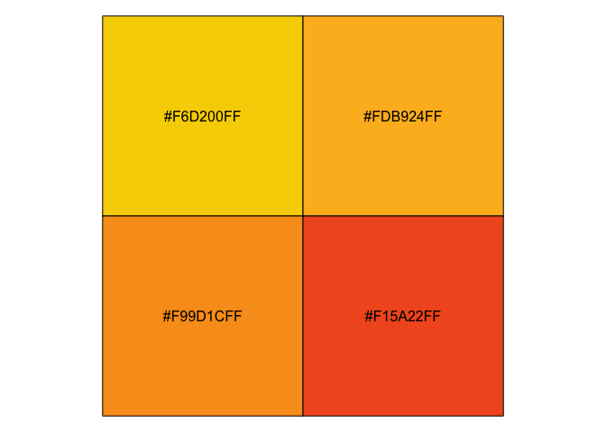

<!-- README.md is generated from README.Rmd. Please edit that file -->

# ggsano

<!-- badges: start -->

<!-- badges: end -->

<<<<<<< HEAD
The goal of ggsano is to uniform the use of colours within the institue
Sciensano. The ggsano package is open-source and can be downloaded by
everyone. Currently the package only includes a discrete and continuous
color palette, but regular updates are planned.

## Installation

Since ggsano is not available on [CRAN](https://CRAN.R-project.org), you
can download the development version from [GitHub](https://github.com/)
by executing the following code:
=======
The goal of ggsano is to …

## Installation

You can install the released version of ggsano from
[CRAN](https://CRAN.R-project.org) with:

``` r
install.packages("ggsano")
```

And the development version from [GitHub](https://github.com/) with:
>>>>>>> a48921101a1a88b93d4da022ca1adea796702aa7

``` r
# install.packages("devtools")
devtools::install_github("rdpauw/ggsano")
```

## Example

<<<<<<< HEAD
This is are the standard discrete colours included in the ggsano
package:

``` r
library(ggsano)
library(scales)
show_col(pal_sciensano()(12))
```



You can specify the colours in each row by specifying the `name`
argument in the functions

``` r
show_col(pal_sciensano(name = "yellow")(4))
```


=======
This is a basic example which shows you how to solve a common problem:

``` r
library(ggsano)
## basic example code
```

What is special about using `README.Rmd` instead of just `README.md`?
You can include R chunks like so:

``` r
summary(cars)
#>      speed           dist       
#>  Min.   : 4.0   Min.   :  2.00  
#>  1st Qu.:12.0   1st Qu.: 26.00  
#>  Median :15.0   Median : 36.00  
#>  Mean   :15.4   Mean   : 42.98  
#>  3rd Qu.:19.0   3rd Qu.: 56.00  
#>  Max.   :25.0   Max.   :120.00
```

You’ll still need to render `README.Rmd` regularly, to keep `README.md`
up-to-date. `devtools::build_readme()` is handy for this. You could also
use GitHub Actions to re-render `README.Rmd` every time you push. An
example workflow can be found here:
<https://github.com/r-lib/actions/tree/master/examples>.

You can also embed plots, for example:


In that case, don’t forget to commit and push the resulting figure
files, so they display on GitHub and CRAN.
>>>>>>> a48921101a1a88b93d4da022ca1adea796702aa7
